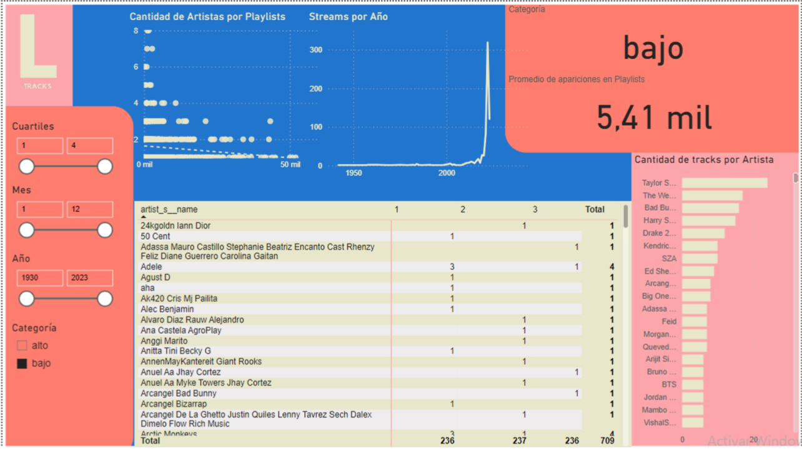

# Pruebas de Hipótesis y Segmentación en PowerBI

Ficha Técnica: Proyecto de Análisis de Datos

Título del Proyecto: Prueba de Hipótesis en PowerBI

Objetivo:
Realizar una prueba de hipótesis, utilizando una técnica de analisis de datos de segmentación y validación de Hipótesis.

Equipo:
Trabajo Grupal.

Herramientas y Tecnologías:
- Python
- Pandas y statsmodels
- Google BigQuery.
- Power BI.
- Google Slides.
- Google Colab

Procesamiento y análisis:
- limpieza de datos
- exploración de datos
- formulas DAX
- consultas SQL
- Técnica de Análisis de datos
  
Resultados y Conclusiones:
Se probo la hipótesis mediante insights concluidos por gráficos de la correlación entre variables.

Validación de Hipótesis:
```python
alpha = 0.05
categoria_a = df[df['categoria_streams'] == 'alto'].shape[0]
categoria_b = df[df['categoria_streams'] == 'bajo' ].shape[0]
muestra_a, muestra_b = df.shape[0]
array_categorias = np.array([categoria_a,categoria_b])
array_muestras = np.array([muestra_a,muestra_b])
p_valor = proportions_ztest(count= array_categorias,nobs = array_muestras)[1]
print(f'{p_valor:.3f}')
```

Dashboard




Limitaciones/Próximos Pasos:
Identifica y describe cualquier limitación o desafío encontrado durante el proyecto.
Sugiere posibles próximos pasos para extender o mejorar el proyecto de análisis de datos.

Enlaces de interés:
[google slides](https://docs.google.com/presentation/d/1toe7RTKU9dDJpv125bwmL84ZtTEeKtMwZs2N945mfSI/edit?usp=sharing)
[google colab](https://colab.research.google.com/drive/1RuRjItPZu4b9CAwKEaQ-BCElUiY2CgA6?usp=sharing)
