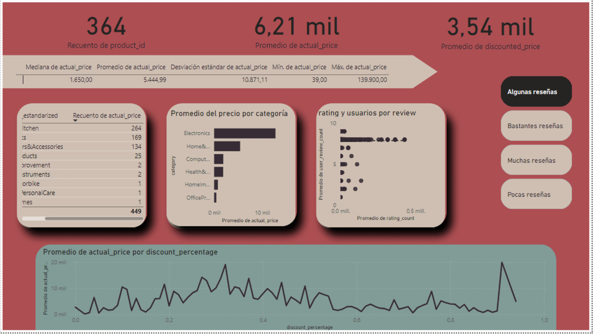

# Pruebas de Hipótesis en PowerBI

Ficha Técnica: Proyecto de Análisis de Datos

Título del Proyecto: Prueba de Hipótesis en PowerBI

Objetivo:
Realizar una prueba de hipótesis, utilizando una técnica de analisis de datos de segmentación.

Equipo:
Trabajo Grupal.

Herramientas y Tecnologías:
- Google BigQuery.
- Power BI.
- Google Slides.

Procesamiento y análisis:
- limpieza de datos
- exploración de datos
- formulas DAX
- consultas SQL
- Técnica de Análisis de datos
  
Resultados y Conclusiones:
Se probo la hipótesis mediante insights concluidos por gráficos de la correlación entre variables.

Realizando la segmentación de datos:

```sql
CREATE OR REPLACE VIEW `datalabp4.proyecto4.quartile_view` AS
SELECT 
    a.product_id,
    a.category_estandarized AS category,
    a.actual_price,
    a.discounted_price,
    a.discount_percentage,
    b.rating,
    b.rating_count,
    NTILE(4) OVER (ORDER BY b.rating_count) AS rating_count_quartile
FROM 
    `datalabp4.proyecto4.amazon_product` a
Inner JOIN 
    `datalabp4.proyecto4.amazon_review` b
ON 
    a.product_id = b.product_id;
```

Dashboard




Limitaciones/Próximos Pasos:
Identifica y describe cualquier limitación o desafío encontrado durante el proyecto.
Sugiere posibles próximos pasos para extender o mejorar el proyecto de análisis de datos.

Enlaces de interés:
[google slides](https://docs.google.com/presentation/d/1FH27WlMYhgo-qVLxuCQ-DrhbPc9KH2Gc2nFprKgzgUQ/edit?usp=sharing)
